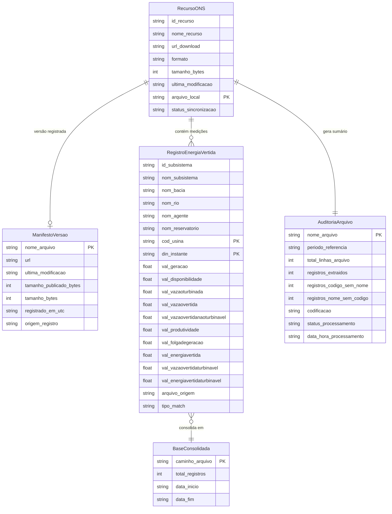

# Data Model: Coleta e Filtragem de Dados ONS - UHE São Domingos

Este documento especifica o modelo de dados, entidades, atributos, tipos e regras de validação para a ingestão, filtragem e consolidação das medições de Energia Vertida Turbinável da UHE São Domingos.

**Revisão de 2026-10-05**: modelo alinhado a `src/models.py`, `src/collector.py`, `src/filter.py` e `src/consolidator.py` como estão após a auditoria de 30/09/2026. Mudanças: nova entidade `ManifestoVersao`; `RecursoONS` ganhou `ultima_modificacao` e o status `UPDATED`; `tipo_match` passou a ter o valor único `CODIGO_E_NOME`; `AuditoriaArquivo` trocou os contadores canônico/secundário por extraídos/só código/só nome e ganhou `codificacao`; unidades corrigidas conforme o dicionário de dados do ONS; chave de unicidade passou a ser (`cod_usina`, `din_instante`). A versão anterior está em `data-model.md.2026-10-05.bak`.

---

## 1. Entidades Principais

---

## 2. Dicionário de Dados

### 2.1 Entidade: `RecursoONS` (Metadados do Portal CKAN)
Representa um arquivo disponibilizado pelo ONS no portal de dados abertos (dataclass `RecursoONS` em `src/models.py`). Existe apenas em memória durante a sincronização.

| Atributo | Tipo | Descrição | Regras de Validação |
| :--- | :--- | :--- | :--- |
| `id_recurso` | String | Identificador UUID gerado pelo CKAN | Copiado do catálogo (campo `id`) |
| `nome_recurso` | String | Título atribuído ao recurso (ex: `Energia_Vertida_Turbinavel-2026-08`) | Copiado do catálogo (campo `name`) |
| `url_download` | String | URL direta de download (AWS S3) | Copiada do catálogo (campo `url`) |
| `formato` | String | Formato do arquivo | Aceito se o formato for `CSV` ou a URL terminar em `.csv`; gravado como `CSV` |
| `tamanho_bytes` | Inteiro | Tamanho publicado no catálogo (campo `size`) | `0` quando o catálogo não informa |
| `ultima_modificacao` | String | Data de última modificação publicada (ex: `2026-09-30T15:05:02.533182`) | Campo `last_modified`, ou `metadata_modified`, ou `created`; vazio se nenhum existir |
| `arquivo_local` | String | Caminho em `data/raw/` | Nome do arquivo na URL (sem parâmetros); se não terminar em `.csv`, `<nome_recurso>.csv` |
| `status_sincronizacao` | String | Estado do arquivo local | `PENDING`, `DOWNLOADED` (novo), `UPDATED` (substituído por versão revisada), `CACHED` (reaproveitado), `FAILED` |

### 2.2 Entidade: `ManifestoVersao` (Registro de Versões Baixadas)
Uma entrada por arquivo em `data/raw/_manifesto_ons.json` (dicionário JSON indexado pelo nome do arquivo local, UTF-8, chaves ordenadas). Gravado de forma atômica ao final da sincronização, inclusive quando ela é interrompida por falha.

| Atributo | Tipo | Descrição |
| :--- | :--- | :--- |
| `nome_arquivo` (chave) | String | Nome do arquivo local (ex: `ENERGIA_VERTIDA_TURBINAVEL_2026_09.csv`) |
| `url` | String | URL de onde a versão foi obtida |
| `ultima_modificacao` | String | `last_modified` publicado no momento do registro |
| `tamanho_publicado_bytes` | Inteiro | Tamanho publicado no catálogo |
| `tamanho_bytes` | Inteiro | Tamanho do arquivo local |
| `registrado_em_utc` | String | Data e hora do registro, em UTC (`AAAA-MM-DD HH:MM:SS`) |
| `origem_registro` | String | `DOWNLOAD` (baixado nesta sincronização) ou `ARQUIVO_EXISTENTE` (arquivo já presente e aceito sem manifesto prévio) |

### 2.3 Entidade: `RegistroEnergiaVertida` (Medição Horária da Usina)
Representa a observação horária de vertimento turbinável. Unidades conforme o dicionário de dados do ONS (`DicionarioDados_EnergiaVertidaTurbinavel.json`, versão 2.0 de 06/06/2024).

| Coluna | Tipo | Formato / Exemplo | Validação / Significado |
| :--- | :--- | :--- | :--- |
| `id_subsistema` | String | `SE` | Sigla do subsistema elétrico |
| `nom_subsistema` | String | `SUDESTE` | Nome do subsistema |
| `nom_bacia` | String | `PARANA` | Bacia hidroenergética |
| `nom_rio` | String | `VERDE` | Rio onde está implantada a usina |
| `nom_agente` | String | `CGT ELETROSUL` (até 02/2026), `AXIA SUL` (desde 03/2026) | Agente de geração; **não** usado na identificação |
| `nom_reservatorio` | String | `SAO DOMINGOS` | Critério de conferência: normalizado, deve conter `SAO DOMINGOS` |
| `cod_usina` | String | `153` | Código da usina nos modelos de otimização do ONS; critério principal de identificação |
| `din_instante` | String | `AAAA-MM-DD HH:MM:SS` (ex: `2018-08-28 00:00:00`) | Hora de início do intervalo horário (00:00 representa 00:00 a 00:59:59), horário legal |
| `val_geracao` | Float | MWmed (ex: `29.92`) | Geração |
| `val_disponibilidade` | Float | MWmed (ex: `47.056`) | Disponibilidade |
| `val_vazaoturbinada` | Float | m³/s | Vazão turbinada |
| `val_vazaovertida` | Float | m³/s | Vazão vertida total |
| `val_vazaovertidanaoturbinavel` | Float | m³/s | Vazão vertida não turbinável |
| `val_produtividade` | Float | MW/(m³/s) | Produtividade |
| `val_folgadegeracao` | Float | MWmed | Folga de geração |
| `val_energiavertida` | Float | MWmed | Energia vertida total |
| `val_vazaovertidaturbinavel` | Float | m³/s | Vazão vertida turbinável |
| `val_energiavertidaturbinavel` | Float | MWmed | Energia vertida turbinável |
| `arquivo_origem` | String | Nome do CSV de onde a linha foi extraída | Rastreabilidade obrigatória |
| `tipo_match` | String | `CODIGO_E_NOME` | Critério aplicado: código e nome do reservatório conferem (único valor produzido) |

As grandezas `val_*` são `None` (vazio no CSV de saída) quando o campo está vazio ou não é numérico; nunca são convertidas em zero. Nenhum limite de plausibilidade é aplicado nesta feature (as regras R1 a R9 pertencem à spec 002).

### 2.4 Entidade: `AuditoriaArquivo` (Controle de Varredura)
Registra o diagnóstico de cada arquivo CSV inspecionado (uma linha por arquivo em `relatorio_auditoria_varredura.csv`).

| Atributo | Tipo | Descrição |
| :--- | :--- | :--- |
| `nome_arquivo` | String | Nome do arquivo (ex: `ENERGIA_VERTIDA_TURBINAVEL_2015.csv`) |
| `periodo_referencia` | String | Nome do arquivo sem extensão (ex: `ENERGIA_VERTIDA_TURBINAVEL_2015`, `ENERGIA_VERTIDA_TURBINAVEL_2026_08`) |
| `total_linhas_arquivo` | Inteiro | Linhas não vazias lidas após o cabeçalho (inclui as descartadas por campos insuficientes) |
| `registros_extraidos` | Inteiro | Linhas em que código e nome do reservatório conferem |
| `registros_codigo_sem_nome` | Inteiro | Linhas com `cod_usina` 153 e outro reservatório (não extraídas) |
| `registros_nome_sem_codigo` | Inteiro | Linhas com reservatório `SAO DOMINGOS` e outro `cod_usina` (não extraídas) |
| `codificacao` | String | `utf-8` ou `latin-1` (codificação com que o arquivo foi lido) |
| `status_processamento` | String | `PROCESSADO` (ao menos 1 extraído), `SEM_REGISTROS` (lido, nenhum extraído), `FALHA` (vazio, sem colunas de identificação ou erro de leitura) |
| `data_hora_processamento` | String | Data e hora da conclusão da varredura do arquivo, em UTC (`AAAA-MM-DD HH:MM:SS`) |

Em `FALHA` por exceção, os contadores ficam em zero e `codificacao` mantém o valor padrão `utf-8`, que pode não ser a codificação real.

### 2.5 Entidade: `BaseConsolidada`
Entidade conceitual que corresponde ao arquivo `data/processed/uhe_sao_domingos_energia_vertida_consolidado.csv` (não há dataclass). Em 30/09/2026: 70.895 registros, de `2018-08-28 00:00:00` a `2026-09-28 23:00:00`.

---

## 3. Regras de Integridade e Validação

1. **Identificação da Usina**: um registro só entra na base se `cod_usina` = `153` e `nom_reservatorio` normalizado (sem acentos, em maiúsculas) contiver `SAO DOMINGOS`. Linhas com apenas um dos critérios são contadas na auditoria e não extraídas.
2. **Unicidade Temporal**: a base consolidada não contém dois registros com o mesmo par (`cod_usina`, `din_instante`). Os arquivos são lidos em ordem alfabética (anuais antes dos mensais) e, em duplicata, prevalece o registro lido por último; duplicatas idênticas e conflitantes são contadas, e as conflitantes registradas em log com os dois arquivos envolvidos. Registros sem `din_instante` são descartados.
3. **Ordenação**: a base é ordenada por (`din_instante`, `cod_usina`); o formato `AAAA-MM-DD HH:MM:SS` garante que a ordem textual seja cronológica. Horas ausentes na fonte (ex.: 04/11/2018 00h, início do horário de verão) não são preenchidas.
4. **Dados Brutos**: os arquivos em `data/raw/` não são editados pelo pipeline. Quando o ONS publica uma nova versão, o arquivo é substituído integralmente por troca atômica (`.part` renomeado) e a versão anterior **não** é preservada (pendência registrada no Histórico de revisões da spec).
5. **Conversão Segura de Tipos**: vírgula decimal é convertida em ponto; campos vazios, `null`, `none` e `nan` tornam-se `None`; valores não numéricos também tornam-se `None`, sem registro em log. Os demais campos são texto com espaços das pontas removidos.
6. **Versão dos Brutos**: uma cópia local (não vazia) só é reaproveitada se o tamanho local for igual ao registrado no manifesto e o `last_modified` do manifesto for igual ao publicado no catálogo (se o catálogo não informar `last_modified`, vale só o tamanho). Sem registro no manifesto, a cópia é aceita se o tamanho local for igual ao publicado, ou, se o catálogo não informar tamanho, apenas por não estar vazia. `--force-download` ignora essas regras.
