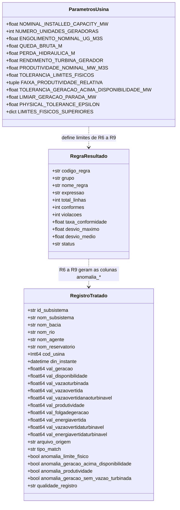

# Data Model: Tratamento, Padronização e Validação Física dos Dados - UHE São Domingos

Este documento detalha o modelo de dados tipado, as regras de validação R1 a R9, a sinalização de anomalias e o schema dos arquivos exportados em Parquet, Excel e CSV.

**Revisão retroativa (2026-10-05)**: modelo atualizado conforme `src/processor.py`, `src/validator.py`, `src/config.py` e os arquivos gerados em 30/09/2026 em `data/processed/`. A versão anterior está em `data-model.md.2026-10-05.bak`; as mudanças estão em "Notas de revisão", ao final.

---

## 1. Esquema da Base Tratada e Entidades de Validação

`RegraResultado` é a dataclass de `src/validator.py`; no CSV de relatório a taxa aparece como `taxa_conformidade_pct` (4 casas) e os desvios com 6 casas. `ParametrosUsina` representa constantes de `src/config.py` (fonte: RF 0009/2017-AGEPAN-SFG, Tabelas 1 a 3), não uma classe: 48 MW instalados (2 × 24 MW), 81,5 m³/s por unidade, queda bruta 35,24 m, perda hidráulica 0,747 m, rendimento 0,9053, produtividade nominal teórica ≈ 0,3063 MW/(m³/s), folga de 5%, faixa de produtividade de 70% a 130%, tolerância de 1,0 MW em R7, limiar de 1,0 MW em R9 e $\epsilon = 10^{-4}$. Os valores e as derivações estão em `research.md`, seção 4.

---

## 2. Tipagem das Colunas

| Coluna | Tipo pandas | Tipo Parquet | Excel (.xlsx) | Valores observados / limite aplicado |
| :--- | :--- | :--- | :--- | :--- |
| `id_subsistema` | `str` | `large_string` | Texto | `SE` |
| `nom_subsistema` | `str` | `large_string` | Texto | `SUDESTE` |
| `nom_bacia` | `str` | `large_string` | Texto | `PARANA` |
| `nom_rio` | `str` | `large_string` | Texto | `VERDE` |
| `nom_agente` | `str` | `large_string` | Texto | `CGT ELETROSUL` (28/08/2018 a 28/02/2026), `AXIA SUL` (a partir de 01/03/2026) |
| `nom_reservatorio` | `str` | `large_string` | Texto | `SAO DOMINGOS` |
| `cod_usina` | `Int64` (inteiro anulável) | `int64` | Número | `153` |
| `din_instante` | `datetime64` (sem fuso; horário publicado pelo ONS) | `timestamp[us]` | Data/hora (`YYYY-MM-DD HH:MM:SS`) | 28/08/2018 00h a 28/09/2026 23h; inválido interrompe |
| `val_geracao` | `float64` | `double` | Número | R1; R6 ≤ 50,4 MW; R7; R9 |
| `val_disponibilidade` | `float64` | `double` | Número | R1; R6 ≤ 50,4 MW; R7 |
| `val_vazaoturbinada` | `float64` | `double` | Número | R1; R6 ≤ 171,2 m³/s; condição de R8 e R9 |
| `val_vazaovertida` | `float64` | `double` | Número | R1; R3 (sem limite superior) |
| `val_vazaovertidanaoturbinavel` | `float64` | `double` | Número | R1; R3 (sem limite superior) |
| `val_produtividade` | `float64` | `double` | Número | R1; R4; R8 entre 0,214 e 0,398 MW/(m³/s) com vazão turbinada > 0 |
| `val_folgadegeracao` | `float64` | `double` | Número | R1; R5; R6 ≤ 50,4 MW |
| `val_energiavertida` | `float64` | `double` | Número | R1; R2 (sem limite superior) |
| `val_vazaovertidaturbinavel` | `float64` | `double` | Número | R1; R3; R4; R6 ≤ 171,2 m³/s |
| `val_energiavertidaturbinavel` | `float64` | `double` | Número | R1; R2; R4; R6 ≤ 50,4 MW |
| `arquivo_origem` | `str` | `large_string` | Texto | 39 arquivos, de `ENERGIA_VERTIDA_TURBINAVEL_2018.csv` a `ENERGIA_VERTIDA_TURBINAVEL_2026_09.csv` |
| `tipo_match` | `str` | `large_string` | Texto | `CODIGO_E_NOME` (critério de extração da Feature 001) |
| `anomalia_limite_fisico` | `bool` | `bool` | Booleano | R6 |
| `anomalia_geracao_acima_disponibilidade` | `bool` | `bool` | Booleano | R7 |
| `anomalia_produtividade` | `bool` | `bool` | Booleano | R8 |
| `anomalia_geracao_sem_vazao_turbinada` | `bool` | `bool` | Booleano | R9 |
| `qualidade_registro` | `str` | `string` | Texto | `OK` ou códigos violados separados por `;` |

Observações:
- Valores ausentes nas métricas ficam NaN (célula vazia no `.xlsx` e no `.csv`, nulo no `.parquet`). Na base de 30/09/2026 não há ausentes nas 10 métricas.
- No `.xlsx` as métricas são células numéricas nativas com formato "Geral" (sem número fixo de casas decimais).
- No `.csv` os números saem com ponto decimal e precisão integral (ex.: `0.3053061224489796`), delimitador `;`, UTF-8.
- Máximos observados na base de 30/09/2026: geração 68,743 MW (o registro de R6); disponibilidade 47,977 MW; vazão turbinada 159,0 m³/s; vazão vertida 445,0 m³/s; vazão vertida não turbinável 104,0 m³/s; produtividade 3,592 MW/(m³/s) (registro de R8); folga 46,782 MW; energia vertida 427,408 MWmed; vazão vertida turbinável 152,309 m³/s; energia vertida turbinável 46,774 MWmed.

---

## 3. Regras de Validação

Tolerância $\epsilon = 10^{-4}$ (`PHYSICAL_TOLERANCE_EPSILON`). Valores ausentes não violam nenhuma regra. A contagem é por registro.

### Consistência interna ONS (grupo "Consistência interna ONS")

1. **R1 - Não-negatividade das grandezas**: viola se alguma das 10 colunas $val\_* < -\epsilon$.
2. **R2 - Energia vertida turbinável contida na energia vertida**: viola se $val\_energiavertida - val\_energiavertidaturbinavel < -\epsilon$.
3. **R3 - Parcelas da vazão vertida contidas no total**: viola se $val\_vazaovertida - (val\_vazaovertidaturbinavel + val\_vazaovertidanaoturbinavel) < -\epsilon$.
4. **R4 - Energia vertida turbinável = vazão × produtividade**: viola se $|val\_energiavertidaturbinavel - val\_vazaovertidaturbinavel \times val\_produtividade| > \epsilon$.
5. **R5 - Folga de geração = disponibilidade − geração**: viola se $|val\_folgadegeracao - \max(0, val\_disponibilidade - val\_geracao)| > \epsilon$.

### Plausibilidade física (grupo "Plausibilidade física")

6. **R6 - Valor acima do limite físico da usina**: viola se $val\_geracao$, $val\_disponibilidade$, $val\_folgadegeracao$ ou $val\_energiavertidaturbinavel > 48 \times 1{,}05 = 50{,}4$ MW, ou se $val\_vazaoturbinada$ ou $val\_vazaovertidaturbinavel > 2 \times 81{,}5 \times 1{,}05 = 171{,}15$ m³/s (`LIMITES_FISICOS_SUPERIORES`).
7. **R7 - Geração acima da disponibilidade declarada**: viola se $val\_geracao > val\_disponibilidade + 1{,}0$ MW.
8. **R8 - Produtividade fora da faixa física**: viola se $val\_vazaoturbinada > 0$ e $val\_produtividade < 0{,}70 \times 0{,}3063$ ou $> 1{,}30 \times 0{,}3063$ (0,214 a 0,398 MW/(m³/s)).
9. **R9 - Geração com vazão turbinada nula**: viola se $val\_vazaoturbinada \le 0$ e $val\_geracao > 1{,}0$ MW.

### Desvios informados no relatório

- R1: valor absoluto do menor valor encontrado (se houver violação).
- R2 e R3: maior déficit entre os registros violados.
- R4 e R5: maior e médio desvio absoluto em toda a base.
- R6: maior excesso sobre o limite; R7: maior excesso da geração sobre a disponibilidade; R8: maior distância da produtividade à nominal; R9: maior geração com vazão turbinada nula.

---

## 4. Sinalização de Anomalias

`sinalizar_anomalias` acrescenta as 4 colunas booleanas e `qualidade_registro` a partir das mesmas máscaras usadas na contagem de R6 a R9 (`mascaras_plausibilidade`). Nenhum registro é removido.

Distribuição na base de 30/09/2026 (70.895 registros):

| `qualidade_registro` | Registros |
| :--- | ---: |
| `OK` | 70.369 |
| `R7` | 278 |
| `R8` | 171 |
| `R9` | 62 |
| `R7;R8` | 13 |
| `R7;R9` | 1 |
| `R6;R7;R8` | 1 (15/05/2019 14h: geração 68,743 MW, disponibilidade 22,817 MW, vazão turbinada 74,0 m³/s, produtividade 0,929) |
| **Total sinalizado** | **526** |

Por regra: R6 = 1, R7 = 293, R8 = 185, R9 = 63. A energia vertida turbinável nos registros sinalizados soma 1.937,3 MWh (de 147.651,1 MWh no período).

---

## 5. Relatório de Validação

- `relatorio_validacao_fisica.csv` (`;`, UTF-8): `codigo_regra`, `grupo`, `nome_regra`, `expressao`, `total_linhas`, `conformes`, `violacoes`, `taxa_conformidade_pct`, `desvio_maximo`, `desvio_medio`, `status` (`CONFORME` ou `VIOLADA`).
- `relatorio_validacao_fisica.md`: cabeçalho (usina e `cod_usina`, versão do dicionário, tolerância, faixa de R8), tabela de resultados, uma frase por regra gerada a partir dos números, ressalva sobre R1 a R5 e tabela com os primeiros 40 registros sinalizados em ordem cronológica.

---

## Notas de revisão (2026-10-05)

- **Diagrama**: `RegistroTratado` ganhou as 5 colunas de sinalização; `cod_usina` passou de `string` para `Int64`. `ResultadoValidacaoFisica` foi substituída por `RegraResultado` (campos reais: `codigo_regra`, `grupo`, `expressao`, desvios). Acrescentada `ParametrosUsina`. `PerfilEstatisticoAno` foi retirada: o perfil anual passou à Feature 003 (`src/analyzer.py`).
- **Tabela de tipos**: a coluna "Limites Físicos Esperados" original (ex.: geração em $[0, 70]$ MWmed, produtividade em $[0, 5{,}0]$, vazão vertida em $[0, 1000]$) não tinha fonte e não correspondia a nenhuma regra aplicada; foi substituída pelos limites efetivamente aplicados por R1 a R9. O limite de 70 MW não detectaria o registro de 68,743 MW.
- **Formato Excel**: o original indicava formatos `0.000` e `0.0000`; a implementação grava as métricas como números com formato "Geral".
- **`tipo_match`**: o original indicava `CANONICAL` e `SECONDARY`; a base atual contém apenas `CODIGO_E_NOME`, conforme a extração por `cod_usina` e reservatório da Feature 001.
- **Regras**: acrescentadas R6 a R9; R1 passou a usar a tolerância $-\epsilon$ e a contar registros; acrescentadas as seções de sinalização e de relatório.
