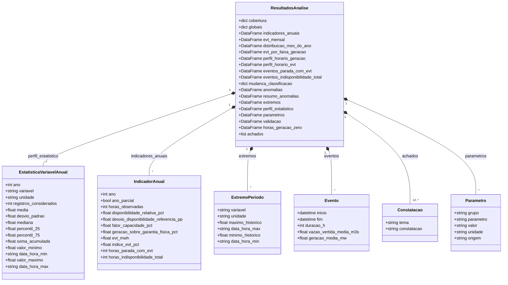

# Data Model: Análise Estatística, Indicadores Operacionais, Visualização Gráfica e Relatório - UHE São Domingos

Este documento detalha as estruturas calculadas pela análise (`ResultadosAnalise`, em `src/analyzer.py`), as abas da planilha, o catálogo de figuras e os campos removidos na revisão de 30/09/2026.

> **Revisão retroativa (2026-10-05)**: modelo reescrito a partir do código. O modelo anterior (entidades `IndicadorPerformanceAnual` com FID, FIT, parecer e causa do vertimento, `RegistroExtremoHistorico` e `CatalogoGrafico` com os gráficos G1 a G5) está em `data-model.md.2026-10-05.bak`; os campos removidos ou renomeados estão na seção 4.

---

## 1. Diagrama de Entidades Analíticas

`IndicadorAnual` está resumido no diagrama; a lista completa de campos está em 2.3. `ResultadosAnalise` tem ainda campos opcionais (dicionários) para os dados da spec 004 (`specs/004-conferencia-outros`): em 05/10/2026, `ons` (indicadores oficiais do ONS por unidade geradora, desde 02/10/2026) e `programacao` (em desenvolvimento). Eles ficam vazios quando esses dados não estão disponíveis; o conteúdo é definido naquela spec.

---

## 2. Dicionário de Estruturas de Dados

### 2.1 `EstatisticaVariavelAnual` (aba `PERFIL_ESTATISTICO_ANUAL`)

Uma linha por ano × grandeza, calculada só com registros `qualidade_registro = "OK"`.

| Campo | Tipo Python / Pandas | Descrição |
| :--- | :--- | :--- |
| `ano` | `int` | Ano civil. |
| `variavel` | `str` | Grandeza `val_*` analisada. |
| `unidade` | `str` | MWmed, m³/s ou MW/(m³/s). |
| `registros_considerados` | `int` | Registros sem anomalia e sem valor ausente no ano. |
| `media` | `float` | Média (4 casas decimais). |
| `desvio_padrao` | `float` | Desvio-padrão amostral (`ddof=1`; 0 se houver um só registro). |
| `mediana` | `float` | Percentil 50%. |
| `percentil_25` | `float` | Primeiro quartil. |
| `percentil_75` | `float` | Terceiro quartil. |
| `soma_acumulada` | `float` | Soma das medições horárias (2 casas). |
| `valor_minimo` | `float` | Menor valor no ano. |
| `data_hora_min` | `str` | `din_instante` do mínimo (`AAAA-MM-DD HH:MM:SS`). |
| `valor_maximo` | `float` | Maior valor no ano. |
| `data_hora_max` | `str` | `din_instante` do máximo. |

---

### 2.2 `ExtremoPeriodo` (aba `EXTREMOS`)

| Campo | Tipo | Descrição |
| :--- | :--- | :--- |
| `variavel` | `str` | Grandeza `val_*`. |
| `unidade` | `str` | Unidade da grandeza. |
| `maximo_historico` | `float` | Maior valor da série, sem registros sinalizados. |
| `data_hora_max` | `str` | `din_instante` do máximo. |
| `minimo_historico` | `float` | Menor valor da série, sem registros sinalizados. |
| `data_hora_min` | `str` | `din_instante` do mínimo. |

---

### 2.3 `IndicadorAnual` (aba `INDICADORES_ANUAIS` e `perfil_estatistico_anual.csv`)

Uma linha por ano civil, com todos os registros (inclusive os sinalizados). $P = 48$ MW; $GF = 36,4$ MWmed; $D_{ref} = (1 − IP) × (1 − TEIF) = 90,97\%$.

| Campo | Tipo | Descrição |
| :--- | :--- | :--- |
| `ano` | `int` | Ano civil. |
| `ano_parcial` | `bool` | Primeiro registro após 1º/jan 00h ou último antes de 31/dez 23h. |
| `horas_observadas` | `int` | Registros no ano. |
| `cobertura_pct` | `float` | Horas observadas ÷ horas do ano civil (8.760 ou 8.784). |
| `geracao_media_mwmed` | `float` | Média de `val_geracao`. |
| `disponibilidade_media_mwmed` | `float` | Média de `val_disponibilidade`. |
| `fator_capacidade_pct` | `float` | Geração média ÷ $P$. |
| `disponibilidade_relativa_pct` | `float` | Disponibilidade média declarada ÷ $P$ (aproximação; não é o FID). |
| `desvio_disponibilidade_referencia_pp` | `float` | `disponibilidade_relativa_pct` − $D_{ref}$, em p.p. |
| `geracao_sobre_garantia_fisica_pct` | `float` | Geração média ÷ $GF$. |
| `energia_gerada_mwh` | `float` | Σ `val_geracao`. |
| `evt_mwh` | `float` | Σ `val_energiavertidaturbinavel`. |
| `evt_vertimento_minimo_mwh` | `float` | EVT nas horas com `val_vazaovertida` ≤ 6 m³/s. |
| `evt_demais_horas_mwh` | `float` | `evt_mwh` − `evt_vertimento_minimo_mwh`. |
| `participacao_vertimento_minimo_pct` | `float` | `evt_vertimento_minimo_mwh` ÷ `evt_mwh`. |
| `indice_evt_pct` | `float` | EVT ÷ (geração + EVT). |
| `horas_com_evt` | `int` | Horas com EVT > 0. |
| `horas_com_evt_pct` | `float` | `horas_com_evt` ÷ `horas_observadas`. |
| `horas_parada_com_evt` | `int` | Horas com geração ≤ 1 MW e EVT > 0. |
| `evt_parada_mwh` | `float` | EVT nessas horas. |
| `horas_indisponibilidade_total` | `int` | Horas com disponibilidade ≤ 0,001 MW. |
| `horas_disponibilidade_ate_metade` | `int` | Horas com 0,001 MW < disponibilidade ≤ 24 MW. |
| `evt_media_diurna_mw` | `float` | EVT média das 9h às 15h. |
| `evt_media_noturna_mw` | `float` | EVT média das 20h às 5h. |
| `razao_evt_diurna_noturna` | `float` | Diurna ÷ noturna. |
| `geracao_media_diurna_mw` | `float` | Geração média das 9h às 15h. |
| `geracao_media_noturna_mw` | `float` | Geração média das 20h às 5h. |
| `razao_geracao_diurna_noturna` | `float` | Diurna ÷ noturna. |
| `horas_com_anomalia` | `int` | Horas com `qualidade_registro` ≠ `OK`. |

---

### 2.4 Indicadores globais (`globais`; aba `INDICADORES_GLOBAIS`, formato `indicador` / `valor`)

| Grupo | Chaves |
| :--- | :--- |
| Mesmos conceitos de 2.3, no período completo | `horas`, `geracao_media_mwmed`, `disponibilidade_media_mwmed`, `fator_capacidade_pct`, `disponibilidade_relativa_pct`, `disponibilidade_referencia_pct`, `desvio_disponibilidade_referencia_pp`, `geracao_sobre_garantia_fisica_pct`, `energia_gerada_mwh`, `evt_mwh`, `indice_evt_pct`, `horas_com_evt`, `horas_com_evt_pct`, `horas_parada_com_evt`, `evt_parada_mwh`, `horas_com_anomalia` |
| EVT e nível de geração | `folga_media_com_evt_mw`, `limiar_plena_carga_mw` (43,2), `evt_plena_carga_mwh`, `evt_plena_carga_pct`, `horas_evt_acima_folga`, `evt_parada_pct`, `disponibilidade_media_nas_paradas_mw` |
| Geração zero | `horas_geracao_zero`, `horas_geracao_zero_com_evt`, `horas_geracao_ate_limiar_positiva_com_evt` (geração entre 0 e 1 MW, com EVT) |
| Qualidade | `evt_em_registros_anomalos_mwh`, `geracao_maxima_registrada_mw`, `instante_geracao_maxima` |
| Acrescentadas na aba | `inicio_serie`, `fim_serie`, `horas_ausentes`, `anos_parciais`, `mes_mudanca_classificacao_vertimento` |

---

### 2.5 Cobertura (`cobertura`; abas `COBERTURA_POR_ANO` e `AGENTES`)

| Chave | Conteúdo |
| :--- | :--- |
| `inicio`, `fim` | Primeiro e último `din_instante`. |
| `horas_observadas`, `horas_esperadas` | Registros e tamanho da grade horária contínua entre `inicio` e `fim`. |
| `horas_faltantes`, `duplicadas` | Instantes ausentes da grade e quantidade de horários repetidos. |
| `por_ano` | `ano`, `primeiro_registro`, `ultimo_registro`, `horas_observadas`, `horas_calendario`, `cobertura_pct`, `ano_parcial`. |
| `anos_parciais`, `anos_completos` | Listas de anos. |
| `agentes` | `nom_agente`, `primeiro_registro`, `ultimo_registro`, `horas`. |
| `identificacao` | `id_subsistema`, `nom_subsistema`, `nom_bacia`, `nom_rio`, `nom_reservatorio`, `cod_usina` presentes na base. |
| `arquivos` | Da auditoria da varredura, se existir: `total`, `com_registros`, `sem_registros` (períodos), `falhas`, `divergencias`. |
| `manifesto` | Do manifesto de versões, se existir: `arquivos`, `ultima_modificacao_mais_recente`, `registro_mais_recente_utc`. |

---

### 2.6 Eventos (abas `EVENTOS_PARADA_COM_EVT` e `EVENTOS_INDISP_TOTAL`)

Horas consecutivas (diferença de 1 h) em que a condição vale; uma lacuna encerra o evento.

| Tabela | Condição | Campos |
| :--- | :--- | :--- |
| `eventos_parada_com_evt` | geração ≤ 1 MW e EVT > 0 | `inicio`, `fim`, `duracao_h`, `geracao_media_mw`, `disponibilidade_media_mw`, `vazao_vertida_media_m3s`, `evt_mwh` |
| `eventos_indisponibilidade_total` | disponibilidade ≤ 0,001 MW | `inicio`, `fim`, `duracao_h`, `vazao_vertida_media_m3s`, `geracao_media_mw` |

---

### 2.7 Distribuições da EVT, perfis horários e horas com geração zero

| Estrutura (aba) | Campos |
| :--- | :--- |
| `evt_mensal` (`EVT_MENSAL`) | `mes` (1º dia do mês), `horas`, `energia_gerada_mwh`, `geracao_media_mw`, `disponibilidade_media_mw`, `evt_mwh`, `evt_vertimento_minimo_mwh`, `evt_demais_horas_mwh` |
| `distribuicao_mes_do_ano` (`EVT_MES_DO_ANO`) | `mes` (1 a 12), `mes_nome`, `evt_mwh`, `participacao_pct` — só anos completos |
| `evt_por_faixa_geracao` (`EVT_POR_FAIXA_GERACAO`) | `faixa_geracao` (até 1 MW; 1 a 10; 10 a 20; 20 a 30; 30 a 40; 40 a 43,2; 43,2 MW ou mais), `horas`, `evt_mwh`, `geracao_media_mw`, `disponibilidade_media_mw`, `participacao_evt_pct` |
| `perfil_horario_geracao`, `perfil_horario_evt` (`PERFIL_HORARIO_GERACAO`, `PERFIL_HORARIO_EVT`) | Linhas = `ano`; colunas = hora 0 a 23; valor = média |
| `horas_geracao_zero` (`HORAS_GERACAO_ZERO_MES`) | `ano`, `jan` a `dez` (vazio quando o mês não tem registros), `total`, `com_disponibilidade_zero`, `com_usina_disponivel` |

---

### 2.8 Mudança de classificação do vertimento (`mudanca_classificacao`)

| Chave | Conteúdo |
| :--- | :--- |
| `mes` | Mês detectado (`Period` mensal) ou `None` se não houver mudança. |
| `meses_antes`, `meses_depois` | Quantidade de meses antes e a partir do mês detectado. |
| `turbinavel_tipica_antes_m3s` | Mediana de `val_vazaovertidaturbinavel` nas horas de vertimento mínimo antes da mudança. |
| `nao_turbinavel_tipica_depois_m3s` | Mediana de `val_vazaovertidanaoturbinavel` nas horas de vertimento mínimo depois da mudança. |
| `evt_media_vertimento_minimo_antes_mw` | EVT média nas horas de vertimento mínimo antes da mudança. |
| `pct_horas_vertimento_minimo_turbinavel_antes` | Horas de vertimento mínimo com vazão turbinável > 0, em % das horas anteriores à mudança. |

---

### 2.9 Qualidade dos dados (abas `ANOMALIAS`, `RESUMO_ANOMALIAS` e `VALIDACAO_REGRAS`)

| Estrutura | Campos |
| :--- | :--- |
| `anomalias` | `din_instante`, `qualidade_registro` (ex.: `R7;R8`), `val_geracao`, `val_disponibilidade`, `val_vazaoturbinada`, `val_produtividade`, `val_energiavertida`, `val_energiavertidaturbinavel` |
| `resumo_anomalias` | `regra` (R6 a R9), `descricao`, `horas`, `primeira_ocorrencia`, `ultima_ocorrencia`, `evt_mwh` |
| `validacao` | Resultado das regras R1 a R9 da Feature 002 (`codigo_regra`, `grupo`, `nome_regra`, `expressao`, `total_linhas`, `conformes`, `violacoes`, `taxa_conformidade_pct`, `desvio_maximo`, `desvio_medio`, `status`) |

---

### 2.10 Constatações (`achados`; aba `CONSTATACOES`)

Lista de pares (`tema`, `constatacao`), na ordem: Cobertura dos dados; Disponibilidade; Indisponibilidades; Geração e garantia física; Energia vertida turbinável; EVT e nível de geração; EVT com a usina parada; Horas com geração zero; Concentração diurna; Distribuição ao longo do ano; Mudança de classificação do vertimento pelo ONS; Qualidade dos dados. As constatações opcionais da spec 004 são intercaladas nas posições definidas naquela spec. Sem os dados opcionais, são 12.

---

### 2.11 Parâmetros (`parametros`; aba `PARAMETROS`)

Campos `grupo`, `parametro`, `valor` (texto formatado), `unidade`, `origem`.

| Grupo | Conteúdo | Origem |
| :--- | :--- | :--- |
| Usina | Potência instalada, unidades geradoras, tipo de turbina, engolimento por unidade, garantia física, IP e TEIF de referência, queda bruta, perda hidráulica, rendimento, vazão remanescente, início da operação comercial | RF 0009/2017-AGEPAN-SFG, Tabelas 1 a 3; garantia física: ANEEL, valor vigente consultado em 02/10/2026; operação comercial: Despachos ANEEL nº 377/2013 e nº 2.692/2013 |
| Derivado | Engolimento máximo (163 m³/s), disponibilidade de referência da GF (90,97%), produtividade nominal teórica | Calculado a partir dos parâmetros da usina |
| Análise | Usina parada, plena carga, vertimento mínimo, indisponibilidade total, janelas diurna e noturna | Parâmetro de análise (`src/config.py`) |
| Validação | Tolerância sobre limites nominais (R6), faixa de produtividade (R8), tolerância de geração acima da disponibilidade (R7) | Parâmetro de análise (`src/config.py`) |
| Fonte | Conjunto de dados Energia Vertida Turbinável (ONS) e, quando presentes, os conjuntos da spec 004 | URL do portal do ONS |

---

### 2.12 Catálogo de Figuras (`NOMES_FIGURAS`)

| Chave | Nome do Arquivo | Tipo do Gráfico | Grandezas |
| :--- | :--- | :--- | :--- |
| `serie_temporal` | `01_serie_temporal_disponibilidade_geracao_evt.png` | Linhas e área (médias diárias), faixas de indisponibilidade ≥ 24 h | `val_disponibilidade`, `val_geracao`, `val_energiavertidaturbinavel` |
| `evt_mensal` | `02_evt_mensal.png` | Barras mensais empilhadas, marco da mudança de classificação | `evt_vertimento_minimo_mwh`, `evt_demais_horas_mwh` |
| `perfil_horario` | `03_perfil_horario_geracao_evt.png` | Dois mapas de calor ano × hora | `val_geracao`, `val_energiavertidaturbinavel` |
| `disponibilidade_anual` | `04_disponibilidade_geracao_anual.png` | Barras agrupadas por ano, linhas de referência | `disponibilidade_relativa_pct`, `fator_capacidade_pct` |
| `vazoes_defluentes` | `05_vazoes_defluentes_anuais.png` | Barras empilhadas por ano, linha do engolimento máximo | `val_vazaoturbinada`, `val_vazaovertidaturbinavel`, `val_vazaovertidanaoturbinavel` |

---

## 3. Abas da Planilha `reports/perfil_estatistico_anual.xlsx`

Na ordem de gravação: `CONSTATACOES`, `INDICADORES_ANUAIS`, `INDICADORES_GLOBAIS`, `COBERTURA_POR_ANO`, `AGENTES`, `EVT_MENSAL`, `EVT_MES_DO_ANO`, `EVT_POR_FAIXA_GERACAO`, `PERFIL_HORARIO_GERACAO`, `PERFIL_HORARIO_EVT`, `EVENTOS_PARADA_COM_EVT`, `HORAS_GERACAO_ZERO_MES` (incluída em 02/10/2026), `EVENTOS_INDISP_TOTAL`, `ANOMALIAS`, `RESUMO_ANOMALIAS`, `VALIDACAO_REGRAS`, `EXTREMOS`, `PERFIL_ESTATISTICO_ANUAL`, `PARAMETROS` (19 abas). Quando há os dados opcionais da spec 004, são acrescentadas as abas definidas naquela spec (em 05/10/2026, prefixos `ONS_*` e, em desenvolvimento, `PROG_*`). Cada aba tem o cabeçalho congelado.

---

## 4. Campos e Entidades Removidos ou Renomeados em 30/09/2026

| Modelo anterior | Situação atual | Motivo |
| :--- | :--- | :--- |
| `IndicadorPerformanceAnual.horas_amostradas` | `horas_observadas` | Renomeado. |
| `fator_disponibilidade_pct` (FID) | `disponibilidade_relativa_pct` | Mesma razão, tratada como aproximação: o FID regulatório (IDv/ID com TEIP e TEIFa) não pode ser obtido deste conjunto. |
| `fator_indisponibilidade_pct` (FIT = 100% − FID) | Removido | Derivado do FID. |
| `energia_vertida_turbinavel_mwh` | `evt_mwh` | Renomeado. |
| `indice_vertimento_turbinavel_pct` (IVT) | `indice_evt_pct` | Renomeado; mesma fórmula. |
| `horas_vertimento`, `taxa_horas_vertimento_pct` | `horas_com_evt`, `horas_com_evt_pct` | Contam horas com EVT > 0. |
| `parecer_performance` | Removido; substituído por `desvio_disponibilidade_referencia_pp` | Os limiares (Satisfatório/Atenção/Crítico) não tinham base regulatória. |
| `principal_causa_vertimento` (`GARGALO_CAPACIDADE_48MW`, `RESTRICAO_DESPACHO_ONS`, `INDISPONIBILIDADE_MAQUINAS`) | Removido; a análise quantifica a EVT por faixa de geração e com a usina parada | O conjunto não informa a causa do vertimento. |
| Coluna "Faixas Normativas" (FC típico 40% a 65%; FID ≥ 90% e FIT ≤ 10% como "padrão ANEEL"; IVT ideal ≤ 5%) | Removida | Faixas sem fonte; a única referência usada é a disponibilidade de referência da garantia física. |
| `EstatisticaVariavelAnual.total_amostras` | `registros_considerados` | Passou a contar só registros sem anomalia; incluído o campo `unidade`; data e hora dos extremos gravadas como texto. |
| `RegistroExtremoHistorico` (`recorde_historico_max`, `data_hora_max`, `recorde_historico_min`, `data_hora_min`, `unidade`) | `ExtremoPeriodo` (`maximo_historico`, `minimo_historico`, ...) | Renomeado; exclui registros sinalizados. |
| `CatalogoGrafico` com `G1` a `G5` (série temporal horária, heatmap mês × hora, dispersão, boxplots, balanço hídrico) | Dicionário `NOMES_FIGURAS` com as 5 figuras de 2.12 | Figuras substituídas; ver `research.md`, seção 10. |
